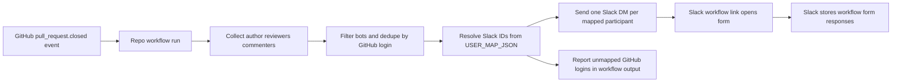

# Architecture

## System shape

The current design is a repo-hosted GitHub Actions workflow that orchestrates participant discovery and Slack DM delivery, while Slack Workflow Builder stores submitted feedback.

## Architectural boundaries

- GitHub Actions is the trigger and orchestration layer.
- `.github/workflows/pr-feedback-slack.yml` installs dependencies, builds the TypeScript code, and runs the compiled PR feedback entrypoint on `pull_request.closed`.
- `src/pr-feedback/participants.ts` is the current participant normalization module.
- `src/pr-feedback/slack-mapping.ts` parses `USER_MAP_JSON`, resolves Slack recipients, and produces unmapped-user report data.
- `src/pr-feedback/slack-delivery.ts` formats PR feedback DMs, opens/reuses Slack DMs through the Slack Web API, and returns structured per-recipient delivery results.
- `src/pr-feedback/action.ts` reads the GitHub event payload plus required secrets, fetches PR reviews/comments from GitHub, runs participant collection + Slack mapping + DM delivery, logs outcomes, and writes GitHub Action outputs.
- Root Node + TypeScript scripts (`npm run build`, `npm test`) validate the shared participant logic.
- Slack app + bot token handle DM delivery.
- Slack Workflow Builder form is the collection surface.
- Slack remains the sole response storage system in v1.
- No fallback Slack identity lookup or external analytics sink exists in v1.
